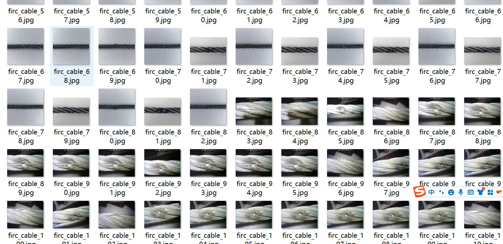
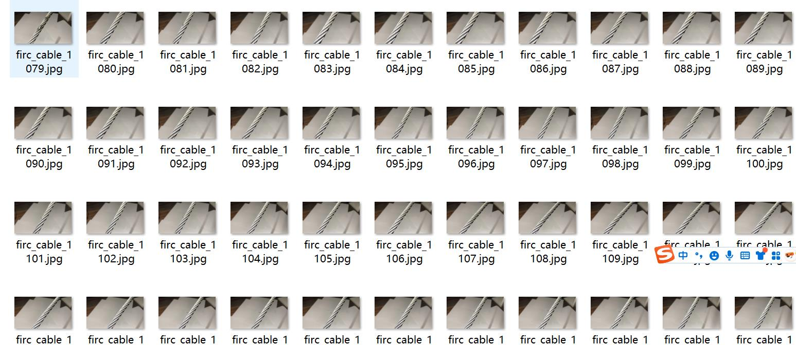
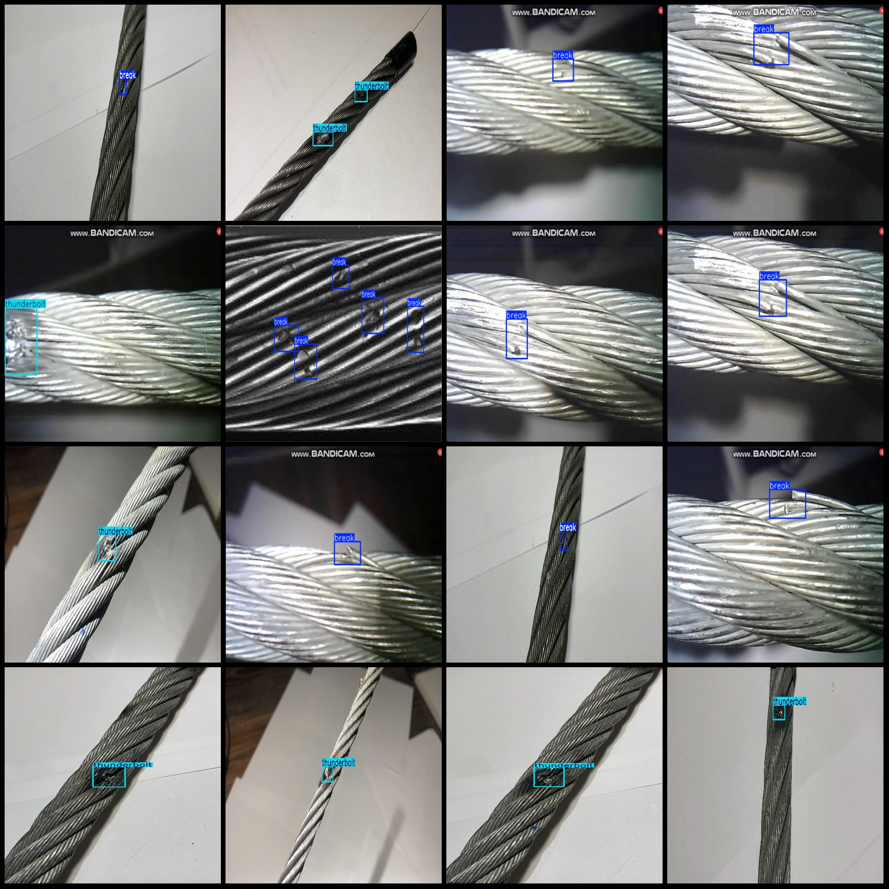
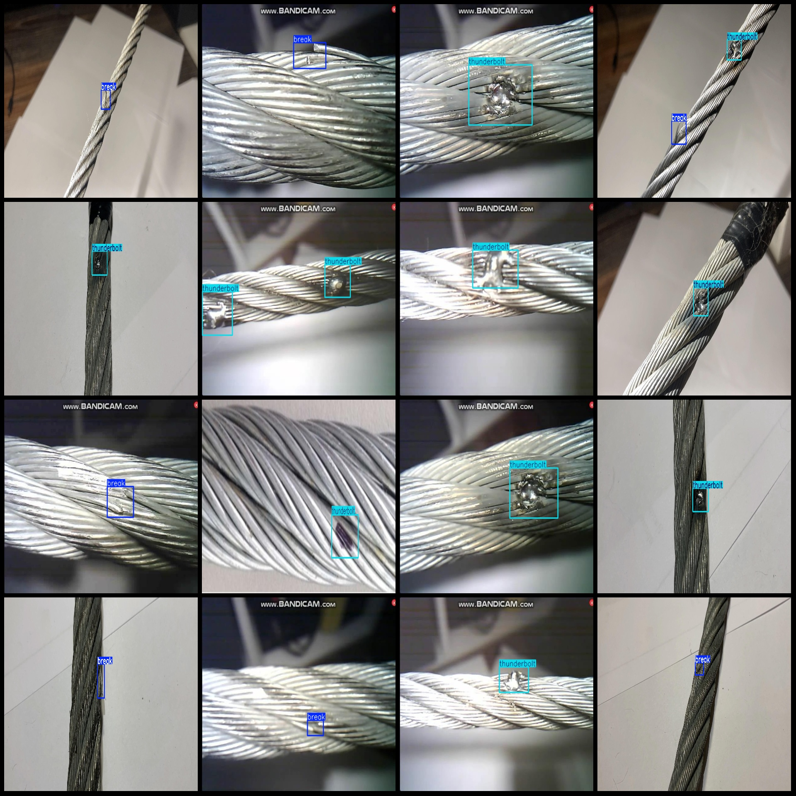

# Steel Wire Cable Damage High Voltage Cable Fault Detection Dataset VOC+YOLO Format: 1317 Images in 2 Categories

Dataset format: Pascal VOC format + YOLO format (txt files without split paths, only containing jpg images along with corresponding VOC format xml files and YOLO format txt files)
Number of images (jpg file count): 1317
Number of annotations (xml file count): 1317
Number of annotations (txt file count): 1317
Number of annotations categories: 2
Annotation category names (note that the order of labels in the YOLO format does not correspond to this, but is based on the "classes.txt" file in the labels folder): ["break", "thunderbolt"]
Number of bounding boxes for each category:
- break (damaged) bounding box count = 822
- thunderbolt (lightning strike marks) bounding box count = 690
Total bounding box count: 1512
Image resolution: 1920x1080
Annotation tool used: labelImg
Annotation rules: drawing bounding boxes for categories
Important note: No special statement is provided.
Special declaration: This dataset does not guarantee the accuracy of the trained models or weight files.
Image preview:
Annotation example:

## Images

Here is a pay link on Stripe ( https://buy.stripe.com/3cs8yP7sY87d0vu9AB ). Please contact me lonlonago@foxmail.com after funding $89, and I will send you a complete data files , thank you!

